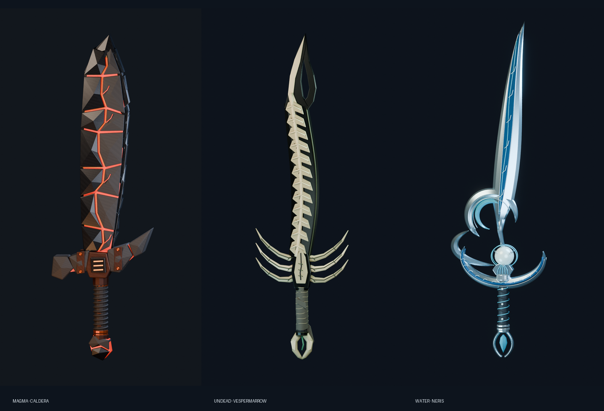

# Elemental Swords

Three original fantasy sword art kits, built as editable Blender meshes and prepared for Roblox import. These are separate designs, not palette swaps of Genesis.

## Choose a sword

- **[Caldera — The Faultline Cleaver](magma/README_IMPORT.md)**: knapped volcanic glass, layered basalt armor, a recessed molten faultline, unequal guard and copper fasteners. [Download model kit](magma/Caldera_Magma_Roblox_Kit.zip) · [Separate GLB](magma/Caldera_Sword.glb) · [Hero](magma/Caldera_Hero.png) · [Front](magma/Caldera_Front.png) · [Detail](magma/Caldera_Detail.png)
- **[Vespermarrow — The Hollow Vigil](undead/README_IMPORT.md)**: hooked grave iron, overlapping vertebral shields, a swept rib cage, bronze sutures and burial linen. [Download model kit](undead/Vespermarrow_Roblox_Kit.zip) · [Hero](undead/Vespermarrow_Hero.png) · [Front](undead/Vespermarrow_Front.png) · [Detail](undead/Vespermarrow_Detail.png)
- **[Neris — Pearl of the Undertow](water/README_IMPORT.md)**: a breaking-wave blade, open curled heel, tidal crescent guard, nacre pearl, woven grip and suspended droplet. [Download model kit](water/Neris_Water_Sword_Roblox_Kit.zip) · [Hero](water/Neris_Hero.png) · [Front](water/Neris_Front.png) · [Detail](water/Neris_Detail.png)

## What's included

Each model kit contains an editable `.blend`, reproducible Blender builder, FBX, OBJ/MTL, texture maps and import notes. Water and undead also include GLB; Caldera's GLB is a separate download. The hero, front and detail preview PNGs are separate downloads alongside each kit rather than repeated inside the ZIPs. All source mesh and texture quality is retained.

For Roblox, start with the FBX and the four standard maps (BaseColor, Normal, Roughness and Metalness), then follow that sword's import notes. ORM is an interchange map, not a Roblox grayscale map slot. Decorative pieces are intentionally overlapping closed shells joined into a single `Handle` mesh, not boolean-unioned manufacturing solids. Read the per-kit notes for atlas and material limitations.

## Validation and scope

Blender geometry, export round trips, textures and ZIP integrity were checked. These assets have **not been tested inside Roblox Studio**; validate importer behavior, scale, grip, SurfaceAppearance and avatar fit there before use. The renders show the actual supplied meshes under studio lighting. Engine appearance can differ, especially emission and lighting.

These are art assets, not finished combat systems. Damage, animations, equip behavior, VFX, server validation and gameplay are not included. No Roblox account upload, game publication, repository merge or deployment is part of this delivery.

Previous Genesis and Orrery files remain unchanged on this branch.
