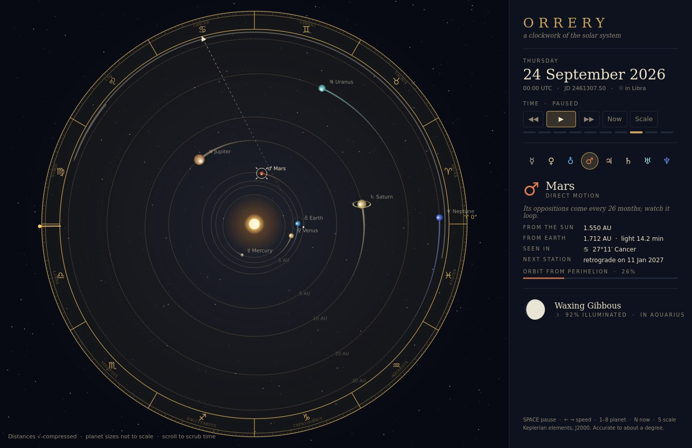
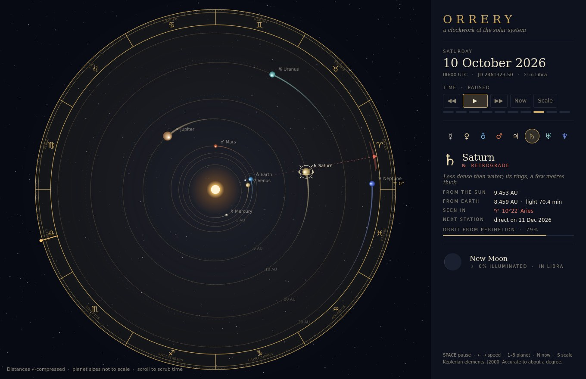
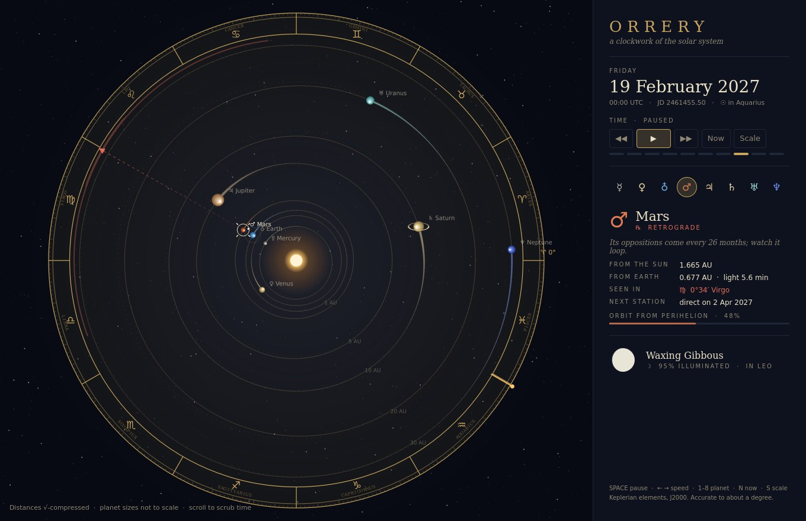
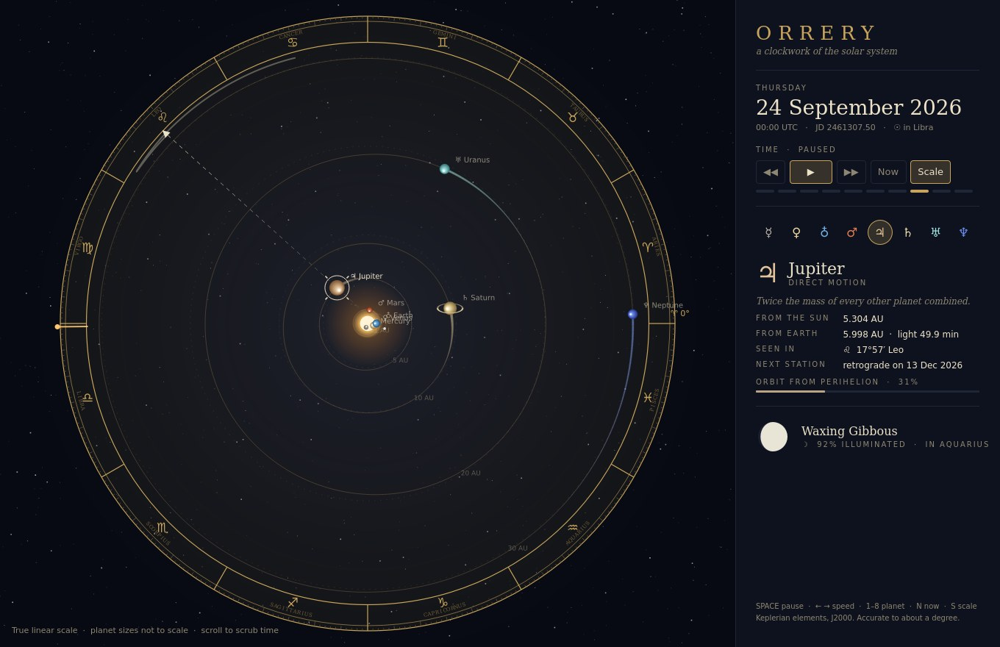

# Orrery

A clockwork of the solar system in QML: eight planets and the Moon on their real
Keplerian orbits (J2000 mean elements), set inside an engraved zodiac dial.



- **Real sky.** Positions from orbital elements and Kepler's equation — about a degree
  of accuracy. It gets the 26 Sep 2026 full moon, Saturn's 2026 retrograde in Aries and
  the Feb 2027 Mars opposition right.
- **Sight lines.** Pick a planet and a ray runs from Earth, through it, to where it sits among
  the signs. A year of its apparent path is traced inside the ring; it turns red while the
  planet is **retrograde**, and the panel predicts the next station.
- **Time.** −1 year/s through real time to +1 year/s, eased between speeds; scroll to scrub.
- **True scale.** `S` morphs from √-compressed distances to honest linear ones.
- Moon phase, sunlit planet shading, Saturn's rings in front of and behind the globe, fading trails.

## Run

```sh
pip install PySide6
python3 main.py
```

Keys: `Space` pause · `←/→` speed · `1–8` planet · `N` now · `S` scale.

`tools/capture.py` renders the stills and animation frames in `media/` headlessly.

| Saturn retrograde | Mars at opposition | True scale |
|---|---|---|
|  |  |  |
